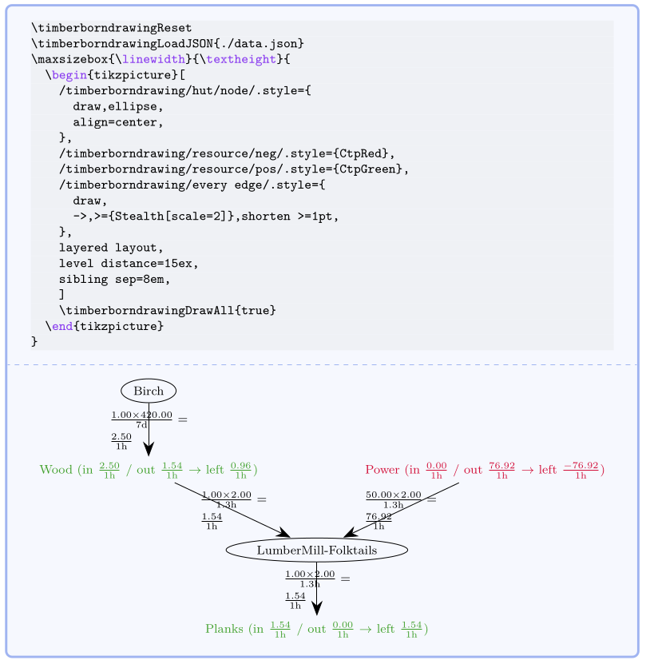

# Readme for the package timberborndrawing

Author: Lukas Heindl (`oss.heindl+latex@protonmail.com`).

<!-- CTAN page: [timberborndrawing](https://ctan.org/pkg/timberborndrawing) -->

## License
The LaTeX package `semesterplannerLua` is distributed under the LPPL 1.3 license.

## Description

This package draws some graphs for the game timberborn. The data is read from a
json file which can be generated via [timberborn_plots](https://github.com/atticus-sullivan/timberborn_plots).
This way the json file can be automatically updated when a new savefile is
written.

For more details and customization you will want to read the [docs](timberborndrawing.pdf).

## Installation

For a manual installation:

* put the files `timberborndrawing.ins` and `timberborndrawing.dtx` in the
same directory;
* run `latex timberborndrawing.ins` in that directory.

The file `timberborndrawing.sty` will be generated.

In addition to the `timberborndrawing.sty` the file `timberborndrawing.lua` is
also required. 
You have to put them in the same directory as your document or (best) in a `texmf` tree. 

### Simplified version:

* run `l3build unpack` to generate the `.sty` (and the `.lua` files) in
`build/unpacked/`
